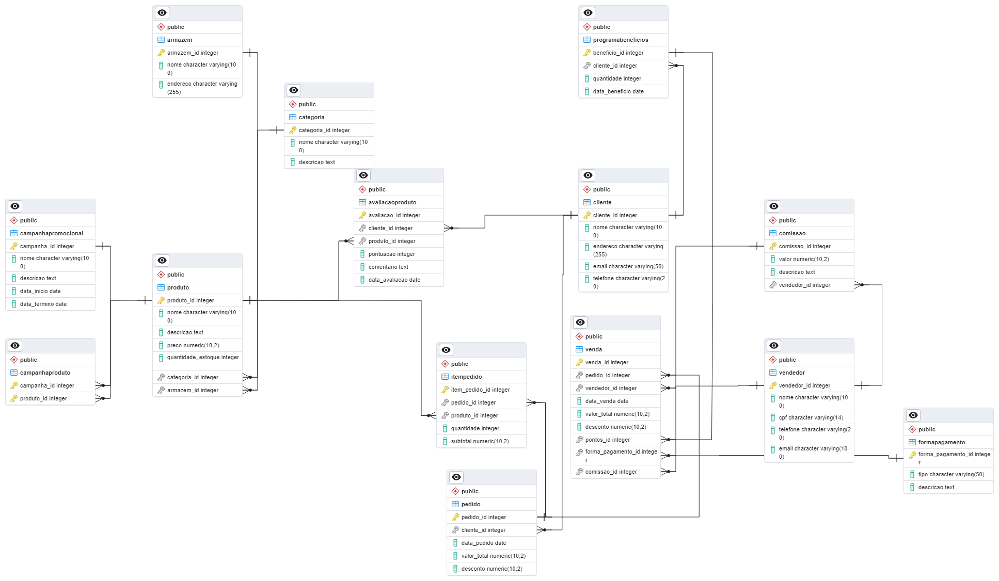

### 1°Projeto Prático - Dados
## Modelagem de Banco de Dados 
  
🤖 Este projeto visa criar um modelo de banco de dados relacional que representa aspectos importantes do negócio do Boticário, com foco nas áreas de vendas, sistema de pontuação e gestão de produtos em estoque. O objetivo é identificar entidades, relacionamentos e atributos relevantes, além de desenvolver a modelagem lógica e física do banco de dados.

## 🚀Etapas do Projeto:
### 🎲Análise de Requisitos:
Identificação das principais entidades, relacionamentos e atributos necessários para a aplicação, considerando vendas, sistema de pontuação e gestão de estoque.
### 🎲Modelagem Lógica (Diagrama ER):
Criação de um diagrama Entidade-Relacionamento que represente a estrutura lógica do banco de dados, mostrando as entidades e seus relacionamentos.
### 🎲Normalização:
Aplicação de técnicas de normalização para organizar eficientemente os dados, garantindo a integridade e reduzindo a redundância.
### 🎲Modelagem Física:
Projeto do banco de dados físico com considerações de desempenho, como índices e chaves primárias, além da implementação das tabelas e relacionamentos.
### 🎲Documentação:
Documentação detalhada da modelagem lógica e física do banco de dados, incluindo descrição de entidades, relacionamentos, atributos e considerações de desempenho.

# 📋 Análise de Requisitos

## 📑 Entidades Utilizadas:
✴ Cliente  
✴ Produto  
✴ Venda  
✴ Pedido  
✴ Item do Pedido  
✴ Forma de Pagamento  
✴ Programa de Benefícios  
✴ Categoria de Produto  
✴ Vendedor  
✴ Armazém  
✴ Campanha Promocional  
✴ Avaliação do Produto  

## 🔀 Relacionamentos:
✴ Um cliente pode fazer várias compras/pedidos (relacionamento 1:N entre Cliente e Pedido).  
✴ Um pedido pode conter vários itens (relacionamento 1:N entre Pedido e Item do Pedido).  
✴ Um pedido gera uma venda (relacionamento 1:1 entre Pedido e Venda).   
✴ Uma venda está associada a uma forma de pagamento (relacionamento N:1 entre Venda e Forma de Pagamento).  
✴ Uma venda gera pontos para o cliente (relacionamento 1:N entre Venda e Programa de Benefícios).  
✴ Um cliente pode ganhar um ou mais pontos (relacionamento N:1 entre Programa de Benefícios e Cliente).  
✴ Um produto pode pertencer a uma ou várias categorias (relacionamento N:M entre Produto e Categoria de Produto).  
✴ Uma venda é realizada por um funcionário (relacionamento N:1 entre Vendendor e Venda).  
✴ Um vendedor recebe uma comissão pela venda (relacionamento 1:1).  
✴ Um produto pode estar armazenado em vários locais de armazenamento (relacionamento N:M entre Produto e Armazém).  
✴ Uma campanha promocional pode envolver vários produtos (relacionamento N:M entre Campanha Promocional e Produto).  
✴ Um cliente pode fazer uma ou várias avaliações de produtos (relacionamento 1:N entre Cliente e Avaliação do Produto). 

## 📋 Atributos:
✴ Cliente: ID, Nome, Endereço, E-mail, Telefone  
✴ Produto: ID, Nome, Descrição, Preço, Quantidade em Estoque, CategoriaID, EstoqueID  
✴ Categoria de Produto: ID, Nome, Descrição  
✴ Armazém: ID, Nome, Endereço  
✴ Pedido: ID, ClienteID, ItemID, Data, Valor Total, Desconto    
✴ Item do Pedido: ID, ProdutoID, Quantidade, Subtotal  
✴ Venda: ID, PedidoID, VendedorID, Data, Valor Total, Desconto, PontosID, FormaPagID, ComissaoID  
✴ Forma de Pagamento: ID, Tipo, Descrição  
✴ Vendedor: ID, Nome, CPF, Telefone, Email  
✴ Comissão: ID, Valor, Descrição, VendedorID  
✴ Programa de Benefícios: ID, ClienteID, Quantidade, Data  
✴ Campanha Promocional: ID, Nome, Descrição, Data de Início, Data de Término  
✴ Avaliação do Produto: ID, Cliente_ID, Produto_ID, Pontuação, Comentário, Data  

## 💡 Modelagem Lógica 
💾 [MER](Boticario.drawio.svg)

## 🏗️Modelagem Física
### 📜[Script](ScriptCriacaoTabelasBD.sql)
### 💾   

## 📄Ferramentas Utilizadas:
✴ Diagrama ER: Draw.io.  
✴ SGBD: PostgreSQL.  
✴ Documentação: Markdown.  

## 📰 Referências:
✴ Documentação do PostgreSQL.  
✴ Livros e recursos online sobre modelagem de banco de dados e SQL.  
✴ Orientações das aulas de Modelagem da Alura.  

## 📄Como Contribuir:
Fique à vontade para sugerir melhorias no modelo de banco de dados ou na documentação.  
Caso encontre algum problema ou tenha dúvidas, abra uma issue para discussão.  
Contribuições são bem-vindas via pull requests.  

Este projeto busca promover o aprendizado e a prática de modelagem de banco de dados em um contexto realista do negócio do Boticário. 
Se você está interessado em contribuir ou aprender mais sobre o assunto, sinta-se à vontade para contribuir! 🚀

# Table of contents  
1. [Análise de Requisitos](#analise-de-requisitos)
    1. [Etapas do Projeto](#etapas-do-projeto)
    2. [Entidades Utilizadas](#entidades-utilizadas)
    3. [Relacionamento](#relacionamentos)
    4. [Atributos](#atributos)  
2. [Modelagem Lógica)(#modelagem-logica)
3. [Modelagem Física](#modelagem-fisica)
4. [Ferramentas Utilizadas](#ferramentas-utilizadas)
5. [Referências](#referencias)
6. [Documentação](#modelagem-de-banco-de-dados)
